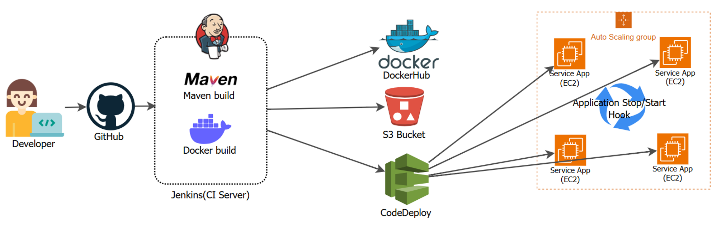
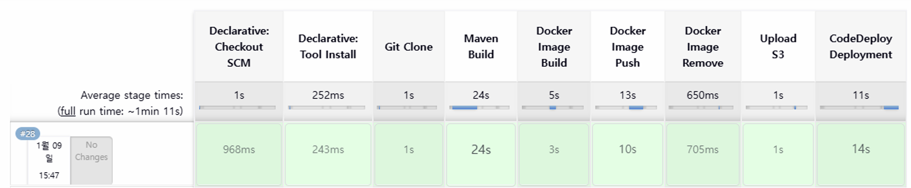

# 🏥 Spring Petclinic: CI/CD Pipeline & Automated Deployment

이 프로젝트는 Spring Boot 기반 Petclinic 애플리케이션을 AWS 클라우드 환경에 자동화된 CI/CD 파이프라인으로 배포하는 전체 과정을 구현한 프로젝트입니다.  
Jenkins, Docker, AWS CodeDeploy를 활용하여 **개발자가 코드를 푸시하면 자동으로 빌드, 배포, 서비스 반영까지 이어지는 실무형 DevOps 워크플로우**를 구축했습니다.

---

## 🚀 Tech Stack
- **Framework:** Spring Boot, Java, Maven
- **CI/CD:** Jenkins, AWS CodeDeploy
- **Containerization:** Docker, Docker Compose
- **Infrastructure:** AWS (EC2, S3, ALB, ASG)

---

## 🏗 Architecture & Flow

1. **Build**  
   Jenkins 컨테이너가 호스트 Docker 엔진(DooD 방식)을 공유하여 Maven 빌드 및 Docker 이미지 생성

2. **Artifact**  
   빌드 산출물을 AWS S3에 업로드하여 배포 소스로 활용

3. **Deploy**  
   AWS CodeDeploy가 S3에서 파일을 가져와 Auto Scaling Group 내 EC2 인스턴스들에 자동 배포

4. **Service**  
   Application Load Balancer(ALB)를 통해 외부 트래픽을 각 인스턴스로 분산 처리

---

## 🛠 주요 설정 파일
- `Jenkinsfile`: 전체 CI/CD 파이프라인 정의 (빌드, 이미지 생성, 배포 트리거)
- `Dockerfile`: 멀티 스테이지 빌드를 적용한 최적화된 애플리케이션 이미지 생성
- `appspec.yml`: CodeDeploy 배포 단계별 스크립트 실행 정의

---

## 📝 Troubleshooting Case Study

### ALB Health Check 실패 및 ASG 무한 재생성 문제 해결

- **문제**  
  배포 이후 EC2 인스턴스가 지속적으로 `Unhealthy` 판정을 받아 ASG가 인스턴스를 반복적으로 종료/생성하는 현상 발생

- **원인**  
  - ALB → EC2 보안그룹 참조 규칙 누락  
  - 애플리케이션 기동 시간 대비 Health Check Grace Period 부족

- **해결**  
  - EC2 보안그룹에 ALB 보안그룹을 소스로 허용  
  - Health Check Grace Period를 300초로 조정  
  → 서비스 안정성과 무중단 배포 환경 확보

---

## 🎯 프로젝트 목표
- CI/CD 파이프라인 전 과정을 직접 구축하며 실무형 배포 자동화 경험 확보
- AWS 인프라 구성 요소(ALB, ASG, CodeDeploy) 간 연동 구조 이해
- 장애 상황 트러블슈팅 및 운영 안정성 개선 경험 축적
